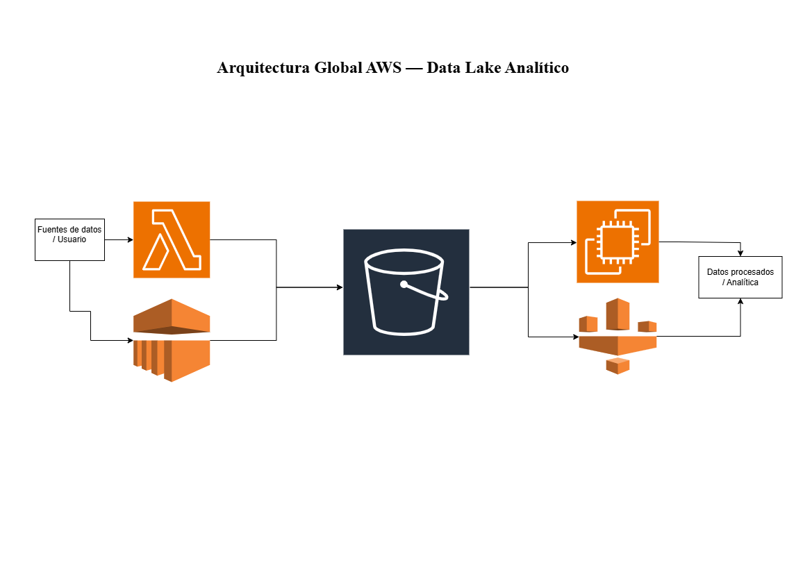

# Resumen Ejecutivo — Arquitectura Global y Estrategia FinOps

## 1. Objetivo

Este documento consolida la visión global del proyecto de análisis de servicios gestionados en AWS, integrando las distintas categorías evaluadas por el equipo en una arquitectura coherente y aportando una estimación consolidada de costes bajo un enfoque FinOps.

El objetivo es proporcionar una referencia unificada que permita comprender no solo qué servicios se han comparado de forma individual, sino cómo encajan entre sí dentro de una arquitectura realista y qué implicaciones técnicas y económicas derivan de dichas decisiones.

---

## 2. Caso de uso de referencia

Se plantea una arquitectura de **Data Lake analítico en AWS**, orientada a la ingesta, almacenamiento y transformación de datos mediante servicios gestionados.

El flujo general contempla:

- Ingesta y ejecución de lógica mediante servicios de cómputo.
- Almacenamiento centralizado en Amazon S3 como núcleo del Data Lake.
- Transformación y procesamiento de datos mediante servicios ETL y Big Data.
- Generación de datasets procesados listos para consumo analítico.

Esta aproximación permite combinar modelos **Serverless** y **IaaS/PaaS gestionado**, equilibrando simplicidad operativa y control técnico según el patrón de uso.

---

## 3. Diagrama de arquitectura

La arquitectura refleja la integración de las categorías analizadas por el equipo:

- **AWS Lambda** para procesamiento event-driven y cargas intermitentes.
- **Amazon EC2** como alternativa de infraestructura IaaS para cargas persistentes o con mayor necesidad de control.
- **Amazon S3** como núcleo del Data Lake (zonas RAW y CURATED).
- **AWS Glue** para procesos ETL gestionados y catalogación de datos.
- **Amazon EMR** para procesamiento distribuido (ej. Spark) en escenarios de mayor volumen o complejidad.

El diagrama permite visualizar cómo las decisiones individuales de cada categoría se articulan dentro de un sistema completo.

---

## 4. Presupuesto global consolidado (FinOps)

Estimación mensual consolidada a partir de los enlaces individuales de AWS Pricing Calculator incluidos en cada categoría analizada por los responsables correspondientes, manteniendo los mismos supuestos de uso definidos en cada análisis.

| Servicio     | Categoría                   | Coste mensual (USD) |
|--------------|----------------------------|---------------------|
| AWS Lambda  | Computación Serverless     | 1,03 |
| Amazon EC2  | Computación IaaS           | 8,32 |
| AWS Glue    | ETL gestionado             | 132,00 |
| Amazon EMR  | Procesamiento Big Data     | 105,12 |

**Total estimado parcial: 246,47 USD/mes**

Las estimaciones se presentan en USD al corresponder con la moneda base utilizada por AWS Pricing Calculator.

> Este total corresponde a las categorías actualmente integradas y se ampliará conforme se incorporen las restantes (Almacenamiento/BD, IA/ML, Redes y Seguridad).

---

## 5. Estrategia FinOps y optimización de costes

Desde una perspectiva FinOps, la arquitectura permite aplicar diversas estrategias de optimización:

- **Savings Plans o instancias reservadas** para cargas estables en EC2.
- **Rightsizing** en clústeres EMR para evitar sobredimensionamiento.
- **Optimización del almacenamiento en S3** mediante políticas de ciclo de vida e Intelligent-Tiering.
- Priorización de servicios Serverless cuando la carga es variable, reduciendo costes de infraestructura inactiva.

Estas medidas permiten alinear decisiones técnicas con eficiencia económica y sostenibilidad financiera del entorno cloud.

---

## 6. Conclusión global y trade-offs

El diseño en AWS implica equilibrar constantemente:

- **Simplicidad vs Control**
- **Elasticidad vs Coste fijo**
- **Rapidez de despliegue vs Flexibilidad técnica**

Los servicios Serverless (Lambda, Glue) reducen carga operativa y permiten pago por uso real, mientras que soluciones basadas en infraestructura (EC2, EMR) aportan mayor control, configurabilidad y previsibilidad en determinados escenarios, a costa de mayor responsabilidad operativa.

La arquitectura consolidada permite visualizar cómo las decisiones técnicas individuales impactan tanto en la complejidad operativa como en el coste total mensual, facilitando una evaluación estratégica integral y apoyando la toma de decisiones informadas en fases posteriores del proyecto.